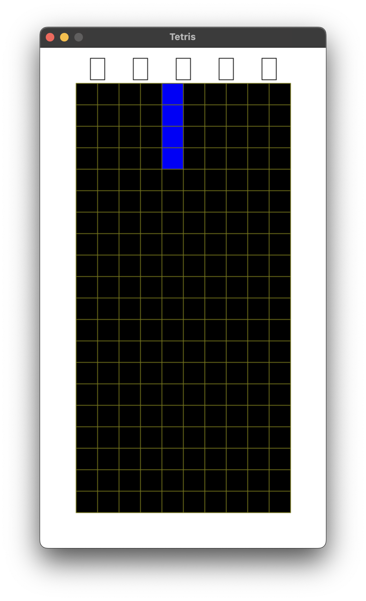
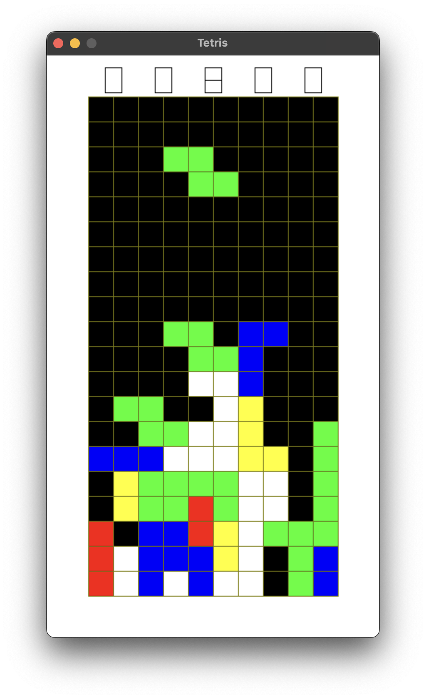
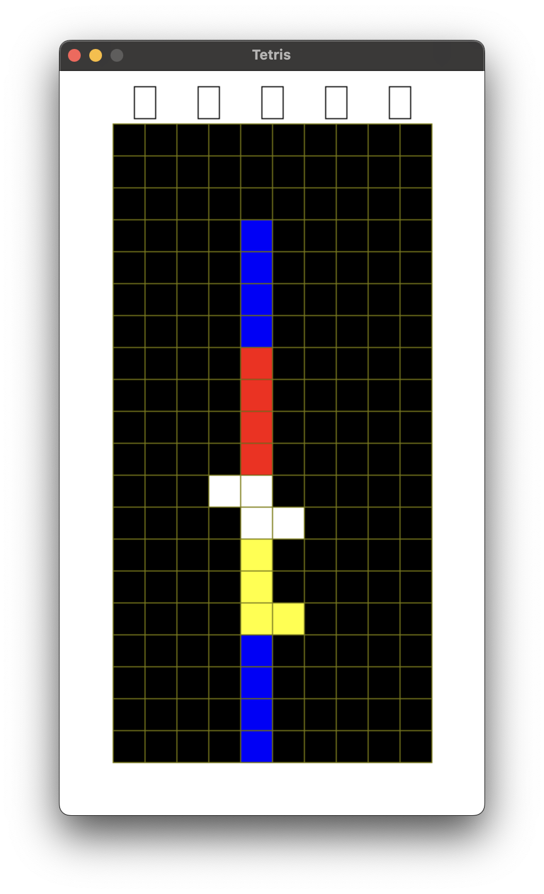

# Tetris Game

This is a simple implementation of the classic Tetris game.


## Features
- Classic Tetris gameplay
- Simple and intuitive controls
- Score tracking

## Requirments
-   git
-   CMake >= 3.28
-   C++ 23 compiler

## Installation
To install and run the Tetris game, follow these steps:

1. Clone the repository:
    ```sh
    git clone `https://github.com/Kemo321/Tetris.git`
    ```
2. Navigate to the project directory and make `build` directory there, then enter build directory:
    ```sh
    cd Tetris
    mkdir build
    cd build
    ```
3. Install the required dependencies and build the project:
    ```sh
    cmake ..
    cmake --build .
    ```
4. Start the game:
    ```sh
    ./Tetris or Tetris (if on windows)
    ```

## How to Play
- Use the left/right arrows to move and arrow up to rotate
- Use arrow down to move down faster
- Press the spacebar to pause
- Press r to restart the game

## Screenshots



